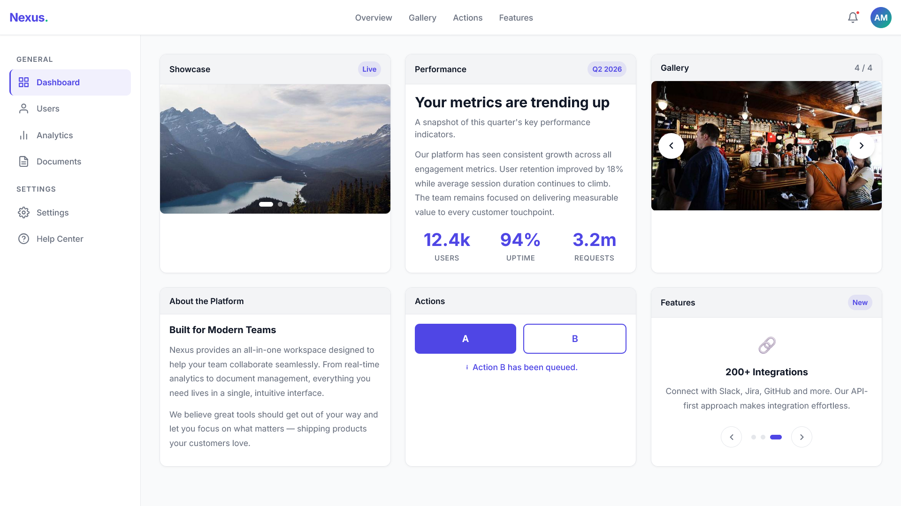

# Nexus Dashboard

A modern, responsive SaaS dashboard built with HTML5, CSS3, and Vanilla JavaScript.

## 📸 Preview

## 🚀 Features

- **Responsive Design**: Fluid grid that adapts from a single column on mobile, to a 2-column layout on tablet, and a 3-column layout on desktop.
- **Modern UI**: Clean, professional design with an indigo and emerald color palette, utilizing CSS variables (design tokens) for consistent styling.
- **Interactive Components**:
  - Auto-advancing image carousel with hover/touch pause.
  - Manual image gallery slider with arrow controls.
  - Animated feature cards slider.
  - Side-by-side action buttons with pulse animations and status feedback.
  - Mobile hamburger menu with sliding sidebar.
- **Touch-Friendly**: 44px minimum touch targets and swipe support for mobile users on all sliders and the sidebar.
- **Performance Optimized**: Uses `loading="lazy"` for off-screen images to improve initial load time.
- **Accessibility**: Includes focus states, `aria-label`, and `aria-expanded` attributes for better screen reader support.

## 📂 Project Structure

- `index.html`: Contains the semantic HTML structure and all the JavaScript modules for interactivity (carousels, sliders, navigation, buttons).
- `styles.css`: Houses all styling, from design tokens (CSS variables) to responsive breakpoints, micro-interactions, and animations.
- `screenshot.png`: Visual preview of the dashboard.

## 💻 Tech Stack

- HTML5
- CSS3 (Vanilla)
- JavaScript (Vanilla, ES6+)
- Google Fonts (Inter)

## 🛠️ Usage

Simply open `index.html` in your web browser. No build steps or dependencies required!
